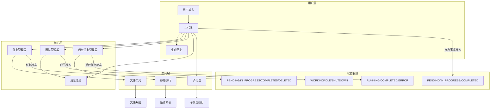
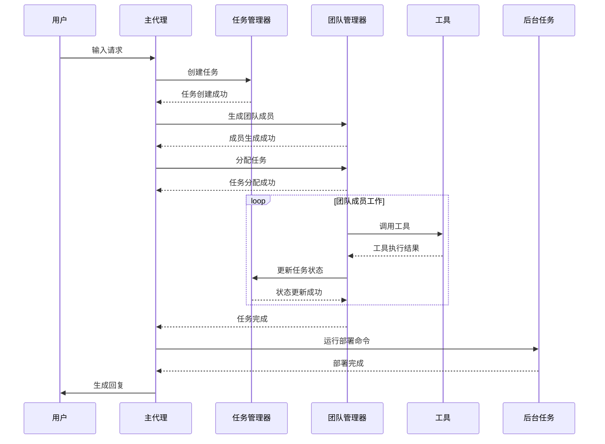

# myclaude 实际工作流程详解

## 实际状态枚举

### 1. 团队成员状态

```python
# 团队成员状态
class TeammateStatus(Enum):
    WORKING = "working"    # 工作中
    IDLE = "idle"          # 空闲
    SHUTDOWN = "shutdown"  # 关闭
```

### 2. 任务状态

```python
# 任务状态
class TaskStatus(Enum):
    PENDING = "pending"        # 待处理
    IN_PROGRESS = "in_progress"  # 进行中
    COMPLETED = "completed"    # 已完成
    DELETED = "deleted"        # 已删除
```

### 3. 待办事项状态

```python
# 待办事项状态
class TodoStatus(Enum):
    PENDING = "pending"        # 待处理
    IN_PROGRESS = "in_progress"  # 进行中
    COMPLETED = "completed"    # 已完成
```

### 4. 后台任务状态

```python
# 后台任务状态
class BackgroundTaskStatus(Enum):
    RUNNING = "running"    # 运行中
    COMPLETED = "completed"  # 已完成
    ERROR = "error"        # 错误
```

## 复杂例子：完整系统工作流程

假设场景："创建一个简单的 Python 项目，包含一个主文件和一个测试文件，然后运行测试"

### 完整工作流程

1. **用户输入**："帮我创建一个简单的 Python 项目，包含一个主文件和一个测试文件，然后运行测试"

2. **主代理处理**：
   - 收到请求，分析需求
   - 决定创建任务列表来跟踪进度

3. **创建任务**：
   - 任务 1：创建主文件 `app.py`
   - 任务 2：创建测试文件 `test_app.py`
   - 任务 3：运行测试

4. **执行任务 1**：
   - 调用 `write_file` 工具
   - 创建 `app.py`，内容：
     ```python
     def hello():
         return "Hello, World!"
     ```
   - 任务 1 状态：`PENDING` → `IN_PROGRESS` → `COMPLETED`

5. **执行任务 2**：
   - 调用 `write_file` 工具
   - 创建 `test_app.py`，内容：
     ```python
     import pytest
     from app import hello

     def test_hello():
         assert hello() == "Hello, World!"
     ```
   - 任务 2 状态：`PENDING` → `IN_PROGRESS` → `COMPLETED`

6. **执行任务 3**：
   - 调用 `background_run` 工具
   - 后台运行 `pytest` 命令
   - 后台任务状态：`RUNNING` → `COMPLETED`
   - 任务 3 状态：`PENDING` → `IN_PROGRESS` → `COMPLETED`

7. **生成回复**：
   - 汇总所有任务完成情况
   - 展示测试结果
   - 回复用户："已完成 Python 项目创建和测试，测试通过！"

## 团队协作例子：多成员完成复杂任务

假设场景："创建一个 Web 应用，包含前端和后端，然后部署到服务器"

### 完整工作流程

1. **用户输入**："帮我创建一个 Web 应用，包含前端和后端，然后部署到服务器"

2. **主代理处理**：
   - 分析需求，决定生成团队成员
   - 创建任务列表

3. **生成团队成员**：
   - 前端开发者（状态：`WORKING`）
   - 后端开发者（状态：`WORKING`）
   - DevOps 工程师（状态：`IDLE`，等待部署）

4. **分配任务**：
   - 任务 1（前端）：创建 React 前端
   - 任务 2（后端）：创建 FastAPI 后端
   - 任务 3（DevOps）：部署到服务器

5. **前端开发者工作**：
   - 状态：`WORKING`
   - 创建前端代码
   - 完成后：`WORKING` → `IDLE`

6. **后端开发者工作**：
   - 状态：`WORKING`
   - 创建后端 API
   - 完成后：`WORKING` → `IDLE`

7. **DevOps 工程师工作**：
   - 状态：`IDLE` → `WORKING`（自动认领任务 3）
   - 部署应用到服务器
   - 完成后：`WORKING` → `IDLE`

8. **主代理汇总**：
   - 所有任务完成
   - 通知用户："Web 应用已创建并部署成功！"

## 系统模块协作 Mermaid 图



## 完整状态流转图



## 实际代码中的状态使用

### 1. 团队成员状态管理

```python
# 团队成员状态设置
def _set_status(self, name: str, status: str):
    member = self._find(name)
    if member:
        member["status"] = status  # 可以是 "working", "idle", "shutdown"
        self._save()
```

### 2. 任务状态管理

```python
# 任务状态更新
def update(self, tid: int, status: str = None, ...):
    task = self._load(tid)
    if status:
        task["status"] = status  # 可以是 "pending", "in_progress", "completed", "deleted"
        if status == "completed":
            # 更新依赖任务
        if status == "deleted":
            # 删除任务文件
```

### 3. 后台任务状态管理

```python
# 后台任务状态更新
def _exec(self, tid: str, command: str, timeout: int):
    try:
        # 执行命令
        self.tasks[tid].update({"status": "completed", "result": output})
    except Exception as e:
        self.tasks[tid].update({"status": "error", "result": str(e)})
```

### 4. 待办事项状态管理

```python
# 待办事项状态验证
def update(self, items: list) -> str:
    for i, item in enumerate(items):
        status = str(item.get("status", "pending")).lower()
        if status not in ("pending", "in_progress", "completed"):
            raise ValueError(f"Item {i}: invalid status '{status}'")
```

## 真实场景：完整系统联动

假设场景："分析当前目录，创建一个待办事项列表，然后执行第一个任务"

### 详细流程：

1. **用户输入**："分析当前目录，创建一个待办事项列表，然后执行第一个任务"

2. **主代理**：
   - 调用 `bash` 工具：`ls -la`
   - 分析目录内容
   - 调用 `TodoWrite` 工具，创建待办事项列表

3. **待办事项列表**：
   - 任务 1：创建 README.md 文件
   - 任务 2：创建 requirements.txt 文件
   - 任务 3：创建主程序文件

4. **执行第一个任务**：
   - 待办事项状态：任务 1 `IN_PROGRESS`，其他 `PENDING`
   - 调用 `write_file` 工具，创建 README.md
   - 待办事项状态：任务 1 `COMPLETED`，任务 2 `IN_PROGRESS`

5. **执行第二个任务**：
   - 调用 `write_file` 工具，创建 requirements.txt
   - 待办事项状态：任务 2 `COMPLETED`，任务 3 `IN_PROGRESS`

6. **执行第三个任务**：
   - 调用 `write_file` 工具，创建主程序文件
   - 待办事项状态：任务 3 `COMPLETED`

7. **生成回复**：
   - 汇总待办事项完成情况
   - 展示创建的文件
   - 回复用户："已完成所有任务，创建了 README.md、requirements.txt 和主程序文件"

## 系统优势

1. **状态管理清晰**：每个组件都有明确的状态定义和流转
2. **模块协作紧密**：各模块通过明确的接口和状态进行协作
3. **扩展性强**：可以轻松添加新的工具、技能和团队成员
4. **容错性高**：即使某个模块出错，整个系统仍能正常运行
5. **自动化程度高**：团队成员可以自动认领任务，后台任务可以自动执行

## 总结

myclaude 系统通过明确的状态管理和模块协作，实现了一个功能强大的智能代理框架。它不仅能处理简单的文件操作，还能管理复杂的团队协作和后台任务，为用户提供全方位的智能助手服务。

通过上面的例子，你应该对系统的工作流程有了更清晰的理解。无论是简单的文件操作还是复杂的团队协作，系统都能通过明确的状态管理和模块协作来完成任务！
